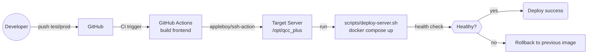

# qcc_plus CI/CD 部署指南

本指南描述 qcc_plus 在测试与生产环境的 CI/CD 流程、服务器准备、Secrets 配置、环境差异以及故障排查。按章节逐步完成可快速上线。

## 1. 概述

- **CI/CD 架构**：代码推送到指定分支后，由 GitHub Actions 触发工作流，远程通过 SSH 登录目标服务器，调用 `scripts/deploy-server.sh` 使用对应的 `docker-compose.*.yml` 完成构建与发布。
- **分支策略**：
  - `test` → 测试环境（端口 8001 / MySQL 3308，容器前缀 `qcc_test_*`）。
  - `prod` → 生产环境（端口 8000 / MySQL 3307，容器前缀 `qcc_prod_*`）。
- **部署流程图**：



> 截图建议：在文档中可插入 GitHub Actions 运行详情的截图（位置：GitHub 仓库 → Actions → Deploy Test/Prod → 最新一次运行）。

## 2. 服务器准备

1. **基础环境**（均需安装且版本保持较新）：`Docker`、`Docker Compose`、`Git`、`Node.js 20+`、`npm`。
2. **创建部署目录**：
   ```bash
   sudo mkdir -p /opt/qcc_plus
   sudo chown "$USER":"$USER" /opt/qcc_plus
   ```
3. **克隆仓库**：
   ```bash
   cd /opt/qcc_plus
   git clone git@github.com:<your-org>/qcc_plus.git .
   ```
4. **配置 SSH 访问**：
   - 生成密钥对：`ssh-keygen -t ed25519 -C "deploy@qcc_plus"`（默认保存 `~/.ssh/id_ed25519`）。
   - 将公钥追加到服务器 `~/.ssh/authorized_keys`，或使用 `ssh-copy-id -i ~/.ssh/id_ed25519 user@server`。
   - 确保 `~/.ssh` 权限为 `700`，`authorized_keys` 为 `600`。

## 3. GitHub Secrets 配置

进入仓库 **Settings → Secrets and variables → Actions**，逐一创建以下 Secrets（名称需精确一致）：

| Secret 名称 | 说明 |
| --- | --- |
| TEST_HOST | 测试服务器公网 / 内网地址 |
| TEST_SSH_USER | 测试服务器 SSH 用户名 |
| TEST_SSH_KEY | 测试服务器私钥全文（含 `-----BEGIN/END OPENSSH PRIVATE KEY-----`） |
| PROD_HOST | 生产服务器地址 |
| PROD_SSH_USER | 生产服务器 SSH 用户名 |
| PROD_SSH_KEY | 生产服务器私钥全文 |
| APP_DIR | （可选）应用部署目录，默认 `/opt/qcc_plus` |

> 截图建议：在 Secrets 页面截图标注“New repository secret”按钮位置，以及已创建的 secret 列表。

**使用 gh CLI 批量配置示例（本地执行）：**

```bash
gh secret set TEST_HOST --body "203.0.113.10"
gh secret set TEST_SSH_USER --body "deploy"
gh secret set TEST_SSH_KEY < ~/.ssh/id_ed25519_test

gh secret set PROD_HOST --body "198.51.100.20"
gh secret set PROD_SSH_USER --body "deploy"
gh secret set PROD_SSH_KEY < ~/.ssh/id_ed25519_prod

# 可选：自定义部署目录
gh secret set APP_DIR --body "/opt/qcc_plus"
```

## 4. 环境配置

### 4.1 环境差异对比

| 项目 | 测试环境 | 生产环境 |
| --- | --- | --- |
| Git 分支 | `test` | `prod` |
| Compose 文件 | `docker-compose.test.yml` | `docker-compose.prod.yml` |
| Compose Project 名 | `qcc_test` | `qcc_prod` |
| Proxy 端口 | 8001 | 8000 |
| MySQL 映射端口 | 3308 | 3307 |
| 容器前缀 | `qcc_test_*` | `qcc_prod_*` |
| 数据卷 | `mysql_data_test` | `mysql_data_prod` |

### 4.2 docker-compose 重点

- **测试**：`proxy` 暴露 8001，MySQL 暴露 3308，容器名 `qcc_test_proxy/mysql`，数据卷 `mysql_data_test`。
- **生产**：`proxy` 暴露 8000，MySQL 暴露 3307，容器名 `qcc_prod_proxy/mysql`，数据卷 `mysql_data_prod`。

### 4.3 环境变量 (.env)

在服务器 `/opt/qcc_plus` 目录下创建 `.env`（可由 `.env.example` 复制）：

```bash
cd /opt/qcc_plus
cp .env.example .env
vim .env
```

必须检查并修改：

- `UPSTREAM_BASE_URL`：上游 API 地址。
- `UPSTREAM_API_KEY`：上游 API Key（生产勿留默认）。
- `ADMIN_API_KEY` / `DEFAULT_PROXY_API_KEY`：默认管理/代理密钥，务必更换。
- `PROXY_MYSQL_DSN`：与 compose 中 MySQL 地址一致，如 `qcc:example@tcp(mysql:3306)/qcc_proxy?parseTime=true`。
- `LISTEN_ADDR`：与对应端口保持一致（测试 `:8001`，生产 `:8000`）。

## 5. 部署流程（自动）

- **触发条件**：向 `test` 或 `prod` 分支推送代码。
- **流水线主要步骤**（见 `.github/workflows/deploy-*.yml`）：
  1) Checkout 代码；
  2) Node.js 20 + npm 缓存，前端 `npm ci && npm run build`；
  3) 通过 `appleboy/ssh-action@v1.2.0` SSH 到目标机；
  4) 在服务器执行 `./scripts/deploy-server.sh <env>`；
  5) GitHub Actions 侧进行 HTTP 健康检查（测试 `http://$TEST_HOST:8001/`，生产 `http://$PROD_HOST:8000/`）。

### 5.1 健康检查机制

- `scripts/deploy-server.sh` 内置 `curl` 检测（默认 12 次、间隔 5 秒）对本机 `127.0.0.1:<port>/` 进行探活。
- Actions 工作流在远端再次做 HTTP 状态码校验，非 2xx/3xx 会标记失败。

### 5.2 回滚机制

- 部署脚本在执行前记录上一版代理镜像 ID，若失败会尝试 `docker tag` 回退并 `docker compose up --no-build` 重新拉起。
- 若自动回滚仍异常，可在服务器执行：
  ```bash
  cd /opt/qcc_plus
  docker compose -p qcc_prod -f docker-compose.prod.yml ps
  docker compose -p qcc_prod -f docker-compose.prod.yml up -d --no-build
  ```

## 6. 手动部署

在目标服务器执行（需已配置 .env 与权限）：

```bash
cd /opt/qcc_plus
git fetch --prune origin
git checkout test   # 或 prod
git pull --rebase origin test
chmod +x scripts/deploy-server.sh
./scripts/deploy-server.sh test   # 或 prod
```

命令快捷方式：`./scripts/deploy-server.sh test` 或 `./scripts/deploy-server.sh prod`。

## 7. 监控与故障排查

- **GitHub Actions 日志**：仓库 → Actions → 对应工作流 → 运行记录 → 查看 `Deploy to test/prod server`、`Health check` 步骤输出。（可插入截图说明按钮位置）
- **容器状态**：
  ```bash
  docker compose -p qcc_test -f docker-compose.test.yml ps
  docker ps --filter "name=qcc_"
  ```
- **容器日志**：
  ```bash
  docker logs -f qcc_test_proxy   # 或 qcc_prod_proxy
  docker logs -f qcc_test_mysql   # 排查数据库健康
  ```
- **常见问题**：
  - 构建失败：检查 npm 依赖或 Node 版本，确保磁盘空间充足。
  - SSH 失败：确认 Secrets 中私钥格式正确且无多余空行；服务器防火墙放行 22 端口。
  - 端口占用：确认宿主 8000/8001、3307/3308 未被其他进程占用。
  - 健康检查失败：`curl http://127.0.0.1:8000/` 查看返回码，配合 `docker logs` 排查。

## 8. 安全最佳实践

- SSH 密钥专用、最小权限，定期轮换；禁用密码登录。
- Secrets 与 `.env` 不入仓；生产密钥与测试隔离。
- 服务器防火墙仅放行 22、应用端口（8000/8001）及必要出口；MySQL 端口仅本机/内网可达。
- 及时更新系统与 Docker 组件；限制 sudo 使用，必要时使用专用部署用户。

## 9. 示例命令合集

- **生成 SSH 密钥对**：`ssh-keygen -t ed25519 -C "deploy@qcc_plus"`
- **测试 SSH 连接**：`ssh -i ~/.ssh/id_ed25519 deploy@${TEST_HOST}`
- **查看容器状态**：`docker compose -p qcc_prod -f docker-compose.prod.yml ps`
- **查看最新部署日志（Actions 下载日志包）**：在运行详情页点击 “Download logs” 按钮（文档可插入该按钮的截图位置说明）。
- **本地模拟健康检查**：`curl -I http://localhost:8000/`

---

按本指南配置后，推送到 `test` / `prod` 分支即可自动完成对应环境的构建与部署，出现异常时优先查看 Actions 日志与容器日志快速定位。
